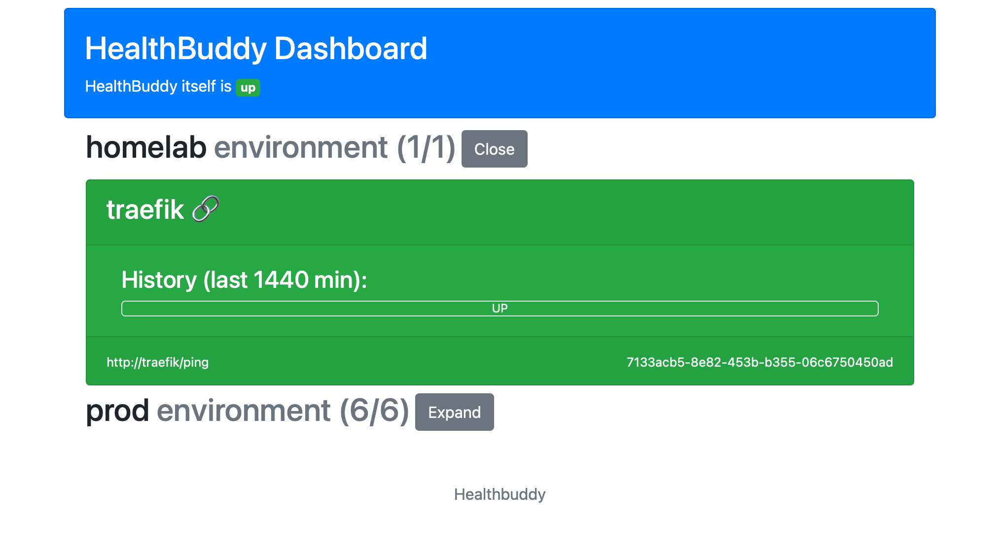

# HealthBuddy


[](https://codecov.io/gh/dschanoeh/HealthBuddy)
[](https://hub.docker.com/r/dschanoeh/healthbuddy)
[](https://hub.docker.com/r/dschanoeh/healthbuddy)

HealthBuddy is a service that periodically queries health endpoints of one
or more services and generates alerts in case these queries fail.

It supports:
* Notifications via:
  * Microsoft Teams channel webhooks
  * Pushover
* A dashboard to observe the current status and history
* Optional Basic Auth
* Operation through an HTTP proxy
* A configurable list of acceptable status codes
* Spring boot actuator body evaluation based on a list of acceptable status

## Installation

You can either rely on prebuilt binaries available on GitHub, build from source or use the docker image.

### Docker

A `docker-compose.yml` is provided in this repository. It expects a
properly configured application.yaml which will then be mounted into
the container.

To download and run the latest version, create an application.yaml and then run:
```
$ docker-compose up -d
```

### Building from Source

An execution of
```
./gradlew build  
```
will generate a fat jar located under build/libs/. 

## Configuration

Save the following as ```application.yaml``` next to the binary for execution:
```yaml
# The update interval (in ms)
updateInterval: 10000
# A list of services and their endpoints to be queried
services: 
  - name: my-service prod
    url: https://foo.bar/actuator/health
    allowedStatusCodes:
      - 200
  - name: other-service prod
    url: http://127.0.0.1
    allowedActuatorStatus:
      - UP
    userName: basicAuthUser
    password: basicAuthPass
notificationServices:
  # Configuration for Teams webhooks
  teams:
    hooks:
      - url: http://127.0.0.1/hook
  # Pushover configuration
  pushover:
    applicationToken: <token>
    recipients:
      - token: <token>
# Optional dashboard configuration
dashboard:
  historyWindowDuration: 15
  basePath: http://192.168.0.7:8080/
# Optional network configuration
network:
  httpProxyHost: 127.0.0.1
  httpProxyPort: 8080
  nonProxyHosts:
    - my-domain.com
  timeout: 5000
  followRedirects: false
# Optional reference endpoint configuration
referenceEndpoint:
  url: https://httpstat.us/200
```

### Service Configuration
For each service, a name and a URL must be configured. Optionally, an environment can be
specified which will be included in alerts.

By default, an established connection to the health endpoint is deemed a success. Additionally,
lists of allowed HTTP status codes and lists of allowed actuator status can be specified that
will then also be evaluated.

The actuator status evaluation assumes the response body to be of the following form (following
the Spring Boot actuator schema):
```json
{"status":"UP"}
```

If user name and password (both or none must be present) are provided, HealthBuddy will perform
basic authentication when calling the health endpoint.

In addition to the config file, it is also possible to set parameters through the environment:
```shell
export NOTIFICATIONSERVICES_TEAMS_HOOKS_0_URL="http://127.0.0.1/hook"
```

### Reference Endpoint
Optionally, a reference endpoint can be specified. This is useful if HealthBuddy itself
is hosted in an environment that may become offline itself (e.g. a home network).

When specified, the reference endpoint will be queried to decide if an alert is to be
suppressed or not. If the reference endpoint also cannot be reached, the alert is
suppressed because it is assumed that the issue is with HealthBuddy itself.

### Notification Services Configuration
It is possible to configure teams webhooks, pushover recipients, or both.

#### Teams Hook Configuration
One or more Teams hooks can be configured. At a minimum, a URL must be provided for each.
Optionally, an environment pattern can be configured. This pattern restricts, incidents for which
environment get sent to this hook.

The following example would send messages for the production environment to the first hook and
messages for any environment starting with test to the second hook.
```yaml
teams:
  hooks:
    - url: http://127.0.0.1/productionHook
      environmentPattern: "^production$"
    - url: http://127.0.0.1/testHook
      environmentPattern: "^test"
```

#### Pushover
In order to use the Pushover integration, you need to first register your instance of
HealthBuddy as a new application. More information on this can be found
[here](https://pushover.net/api).

Afterwards a number of recipients can be configured. These can be either users identified
by a user token or whole groups identified by a group token.

```yaml
  pushover:
     applicationToken: <token>
     recipients:
        - token: <token>
          environmentPattern: "^production$"
```
### Dashboard
HealthBuddy listens on port 8080 and provides a dashboard giving an overview of the status of
all services grouped by environment.

Additionally, an incident history is computed for each service. The duration of the history window
can be configured via `historyWindowDuration` which is given in minutes.

If a `basePath` is configured, notification services will use it to link to the dashboard for quick
access to the incident details.

### Proxy Configuration
A proxy can be provided through any of the following means which take precedence in the order
shown here:
1. Through the network section of the configuration file
2. Through Java system properties(`http.proxyHost`, `https.proxyHost` and corresponding 
   port, user and Password variables as well as `http.nonProxyHosts`)
3. Through the environment variables HTTP_PROXY, HTTPS_PROXY and NO_PROXY